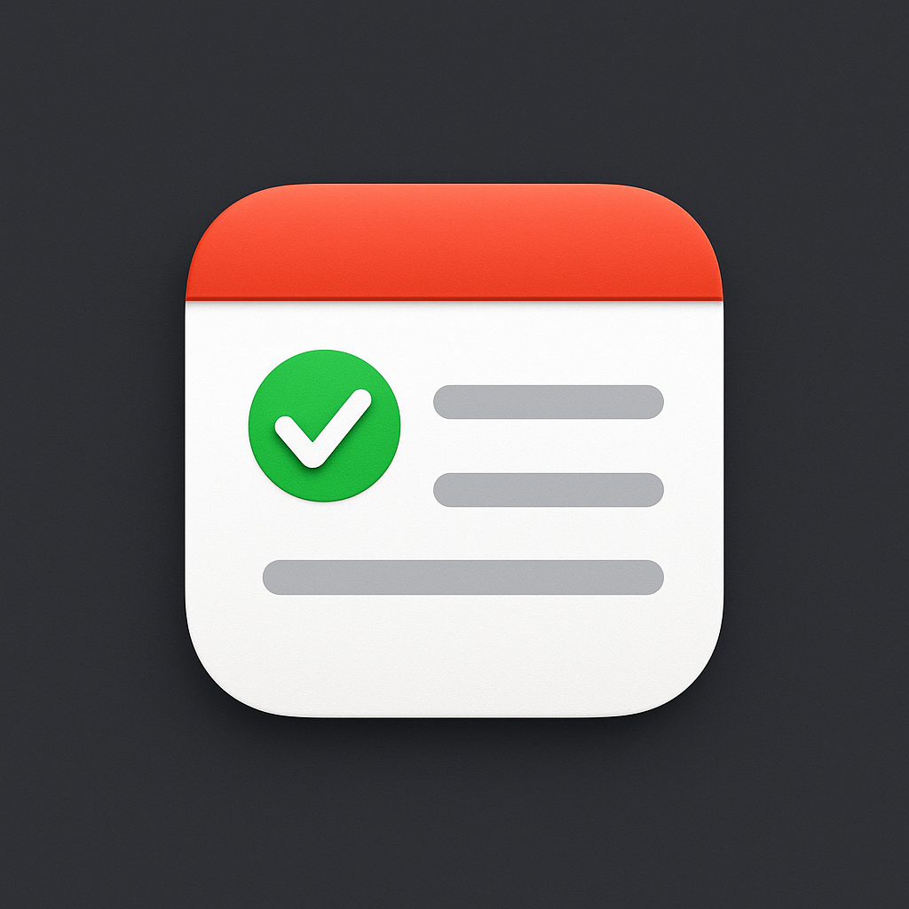
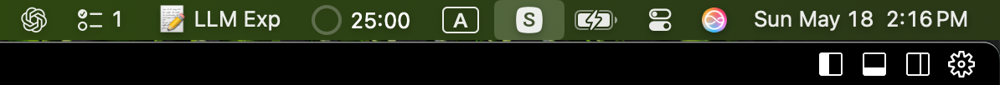

# Reminders Menu Bar

<div align="center">
  
</div>

Simple macOS menu bar app to view the first item in MacOS Reminders app.

## Preview
<div align="center">
  
</div>

## Build From Source

```bash
rm -rf build dist ./ReminderMenuBar.dmg ./Reminder\ Menu\ Bar.spec
pip install pyinstaller
pyinstaller --windowed --name "Reminder Menu Bar" --icon=icon.icns print_meunbar.py
dmgbuild -s dmg_settings.py "Reminder Menu Bar" "ReminderMenuBar.dmg"
```


